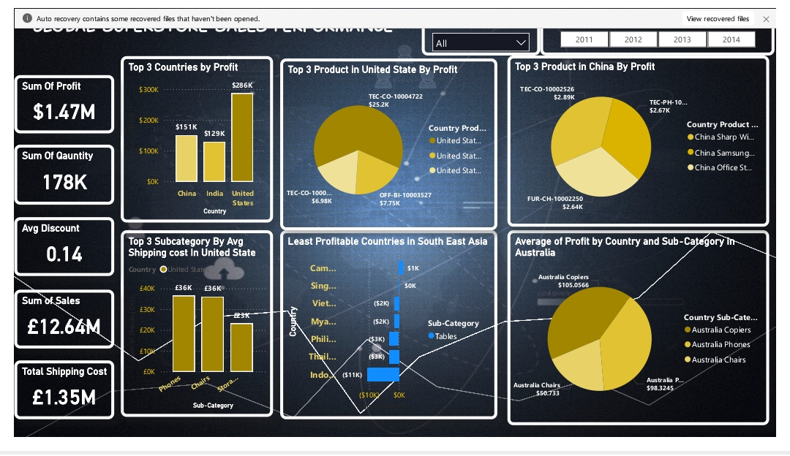

<h1 align="center">
🌍 Global Superstore Sales Analytics Dashboard
</h1>

<p align="center">
  
</p>

---

## 🧾 Project Overview

This Power BI project explores **retail sales performance** across over **30 countries**, helping stakeholders visualize key metrics and drive data-informed decisions. The dashboard focuses on:

- 💰 **Profitability by Region and Segment**
- 📦 **Shipping Costs vs. Revenue**
- 🛒 **Product-level Performance**
- 🎯 **Discount Impact Analysis**
- 📉 **Loss Prevention Recommendations**

---

## 🌟 Key Insights

- 🇺🇸 **USA** ranked highest in profitability with **$286K+** in net profit.
- 🌏 **Southeast Asia** underperformed — prompting strategic reviews.
- 🛍️ Discounts negatively impacted margins — recommend optimizing discount strategy.
- 🚚 High shipping costs in Standard Class deliveries flagged for review.

---

## ⚙️ Tools & Technologies Used

| Tool            | Description                             |
|-----------------|-----------------------------------------|
| **Power BI**    | Dashboard creation, slicers, drilldowns |
| **DAX**         | KPIs, Time Intelligence, Measures       |
| **Excel**       | Pre-cleaning and transformation         |
| **CSV Dataset** | Sales, customer, and fulfillment data   |

---

## 📸 Dashboard Preview


<sub><i>(Replace with actual screenshot of your Power BI dashboard)</i></sub>

---

## 📁 Repository Structure

```bash
📁 global-superstore-sales-dashboard
├── 📊 Superstore_Dashboard.pbix      # Power BI file
├── 📄 Superstore_Dataset.csv         # Cleaned dataset
├── 📝 README.md                      # Project documentation
